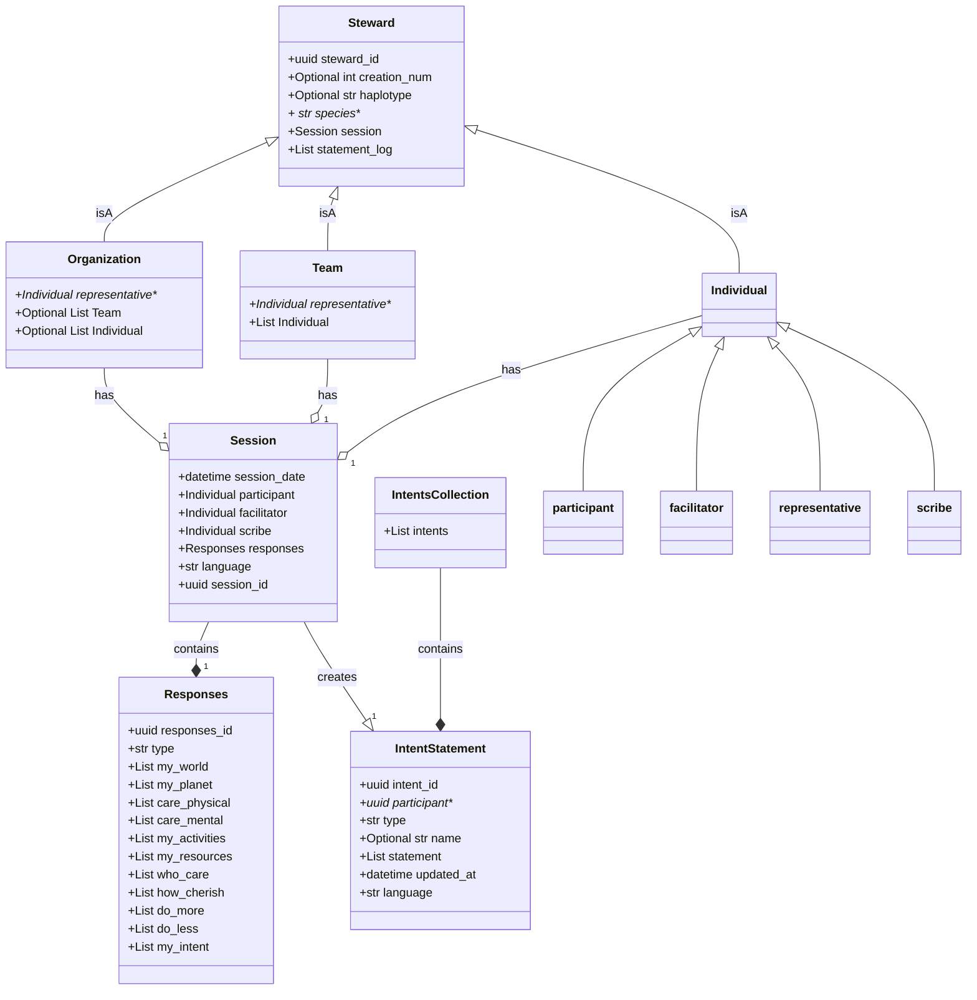

## INTENT Data Models Diagram

## 
THE WELL is about INTENTs. It holds the INTENT statements and associated responses. It creates a resource --collective wisdom-- out of them.
STEWARD is about identity. It authenticates, maintains and protects identity information. It initiates all creation and changes to INTENT statements.

### Initial flow: 
1. The first Entity object is created by hand   
2. A response object is created. 
3. A session object is created. It contains the facilitator entity and the responses
4. An entity is created. It contains reference to their session

### Create an initial INTENT Statement
1. Facilitator authenticates with STEWARD and provides participant contact info
3. STWEARD initializes a Steward object, sends consent request to participant
4. Participant consents
5. STEWARD sends a unique ID to THE WELL
6. Participant creates a responses 
7. Facilitator populates THE WELL form with responses and submits 
8. THE WELL stores reponses with unique ID as temp and informs STEWARD 
9. STEWARD sends to partipant and facilitator
10. Participant receives thank you from STEWARD with responses and consent form
11. STEWARD informs THE WELL, assigns creation number, faciltator gets credit
12. THE WELL to publishes session  

## UPDATE and INTENT STATEMENT
