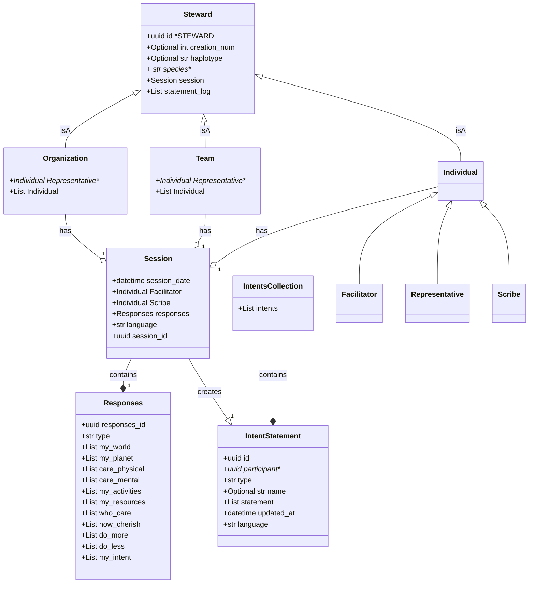

## INTENT Data Models Diagram

### Initial flow: 
1. The first Entity object is created by hand   
2. A response object is created. 
3. A session object is created. It contains the facilitator entity and the responses
4. An entity is created. It contains reference to their session
