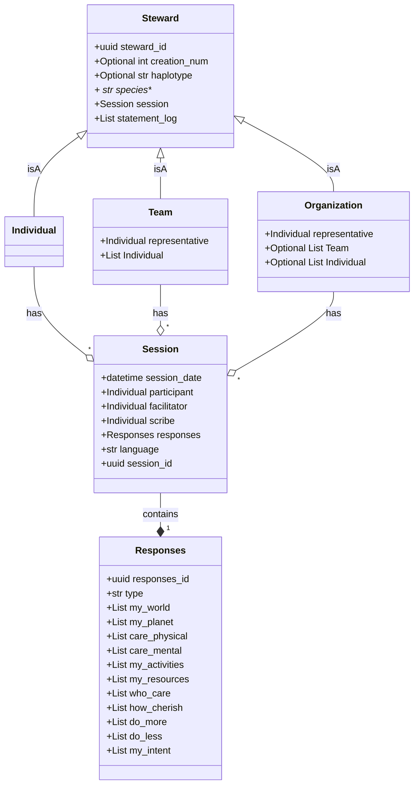

## INTENT Data Models Diagram

## 
THE WELL is about INTENTs. It holds the INTENT statements and associated responses. It creates a resource --collective wisdom-- out of them.  

STEWARD is about identity. It authenticates, maintains and protects identity information. It initiates all creation and changes to INTENT statements.

### Create an initial INTENT Statement
1. Individual facilitator authenticates with STEWARD and inputs Steward participant details (this is the representative in the case of a Team or Org) along with other details of the session (e.g., scribe, language)
3. STEWARD initializes a Steward class object (Ind, Team, or Org), sends consent request to Individual participant
4. Individual participant consents to STEWARD
5. STEWARD sends a Session_id to THE WELL
6. Participant creates responses
7. Scribe populates THE WELL form with responses and submits 
8. THE WELL stores Reponses with session_id as temp and informs STEWARD 
9. STEWARD sends responses to Entity partipant and Individual facilitator
10. Participant receives thank you from STEWARD with responses, consent form, and link to their info
11. STEWARD informs THE WELL, assigns creation number to Entity participant, Individual faciltator gets credit
12. THE WELL to publishes Session  

## UPDATE and INTENT STATEMENT
