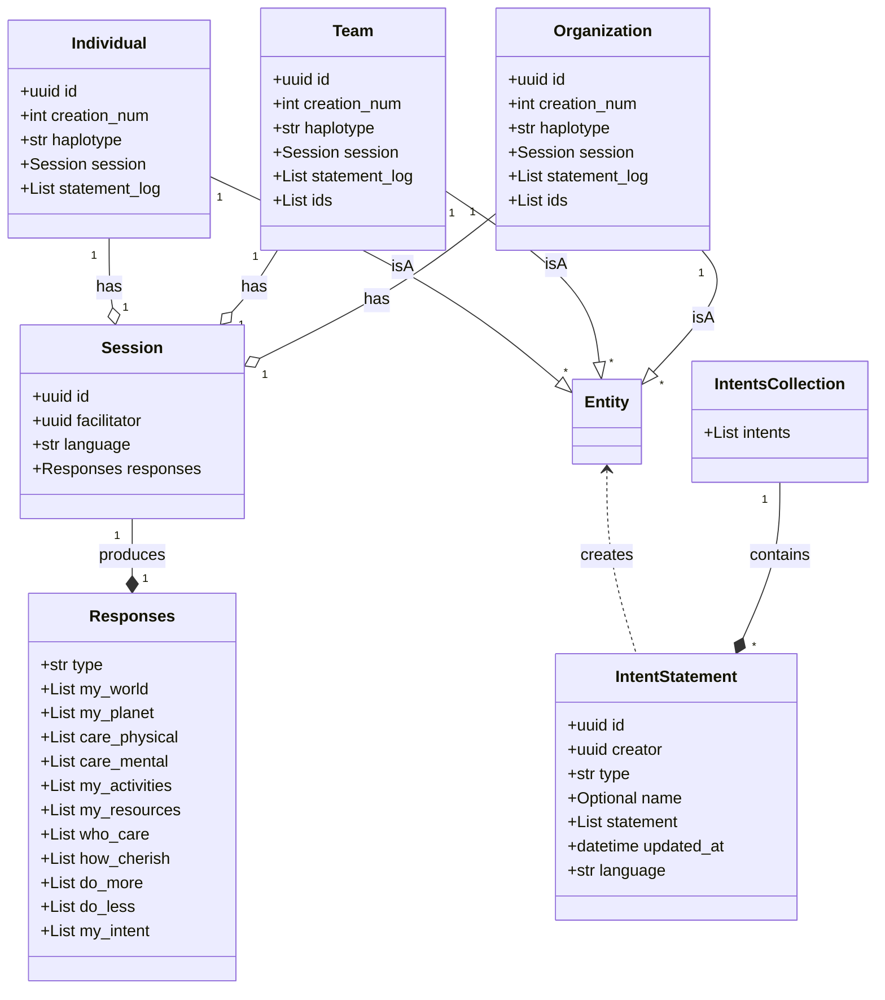

## INTENT Class Diagram

```mermaid
classDiagram
    class Individual {
        +uuid id
        +int creation_num
        +str haplotype
        +Session session
        +List statement_log
    }
    class Team {
        +uuid id
        +int creation_num
        +str haplotype
        +Session session
        +List statement_log
        +List ids
    }
    class Organization {
        +uuid id
        +int creation_num
        +str haplotype
        +Session session
        +List statement_log
        +List ids
    }
    class Session {
        +uuid id
        +uuid facilitator
        +str language
        +Responses responses
    }
    class Responses {
        +str type
        +List my_world
        +List my_planet
        +List care_physical
        +List care_mental
        +List my_activities
        +List my_resources
        +List who_care
        +List how_cherish
        +List do_more
        +List do_less
        +List my_intent
    }
    class IntentStatement {
        +uuid id
        +uuid creator
        +str type
        +Optional name
        +List statement
        +datetime updated_at
        +str language
    }
    class IntentsCollection {
        +List intents
    }
    Individual "1" --o "1" Session : has
    Team "1" --o "1" Session : has
    Organization "1" --o "1" Session : has
    Session "1" --* "1" Responses : produces
    Individual "1" --|> "*" Entity : isA
    Team "1" --|> "*" Entity : isA
    Organization "1" --|> "*" Entity : isA
    Entity <.. IntentStatement : creates
    IntentsCollection "1" --* "*" IntentStatement : contains

```

